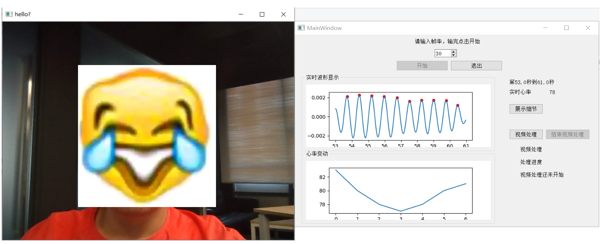
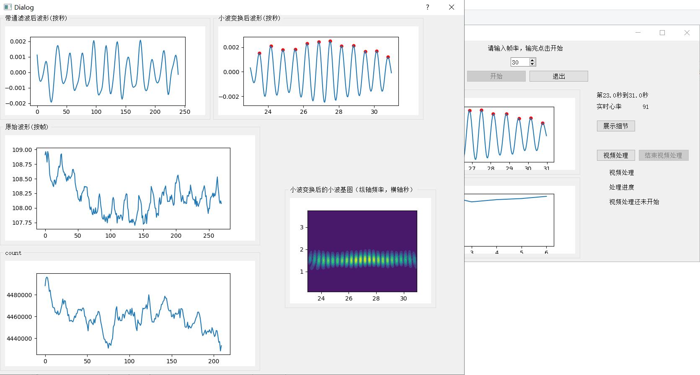

# rPPG_UI_interface
UI interface, which allows user to quickly learn about their current heart rate via webcam.

<div align="center">
  
</div>

<div align="center">
  
</div>

## Preparation
<!-- Requirements: This code befits windows platform with cuda installed (with common GPU).
    ```bash
    Requirements:
    python==3.7
    pyqt5==5.15.0
    cython==0.29.21
    pycwt==0.3.0a22
    opencv-python==4.5.4.60
    dlib==19.18 (require CUDA else can run properly)
    scipy==1.7.2
    scikit-learn==1.0.1
    numpy==1.19.5
    ``` -->

1. Requirements: This code befits windows platform with cuda installed (with common GPU).
    ```bash
    Requirements:
    python==3.7
    pyqt5==5.15.0
    cython==0.29.21
    pycwt==0.3.0a22
    opencv-python==4.5.4.60
    dlib==19.18 (require CUDA else can run properly)
    scipy==1.7.2
    scikit-learn==1.0.1
    numpy==1.19.5
    ```

## Running
1. Run "main.py" and press "开始", if you want to process offline videos, press "视频处理" and select output dir.

